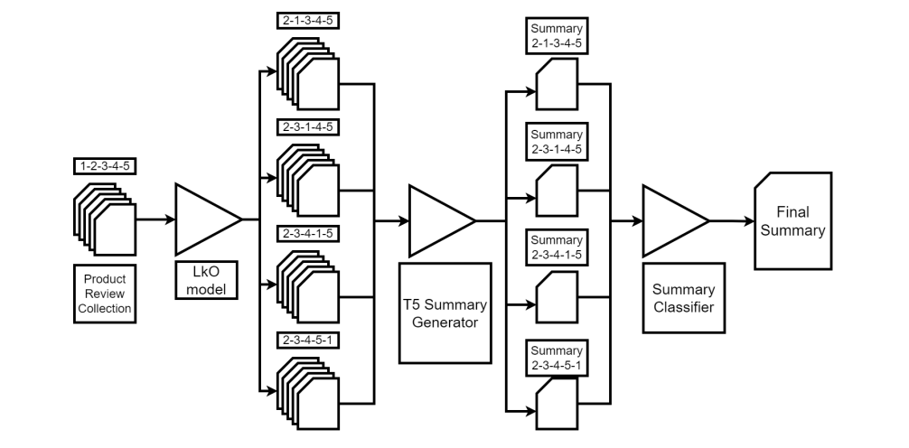

# AMAZON Product Reviews Summary Generation

My goal for this project is to write coherent and concise summaries of Amazon product reviews so that customers can make more informed decisions about the things they want to purchase! I will be uploading sections of this work-in-progress repository as I complete them.

The goal of this project is to apply the techniques discussed in the original paper, [PASS: Perturb-and-select summarizer for product reviews](https://www.amazon.science/publications/pass-perturb-and-select-summarizer-for-product-reviews), in order to gain practical experience and understanding of working with Large Language Models (LLMs).

## Text Summary Generation using T5

T5 is a large pre-trained Transformer based (Seq-Seq) model which I have fine-tuned on a small publically available [dataset](https://github.com/abrazinskas/FewSum).

A few hundred training points make up the dataset. Eight customer reviews and three summaries, each handwritten by a qualified human annotator, are included in each datapoint.
